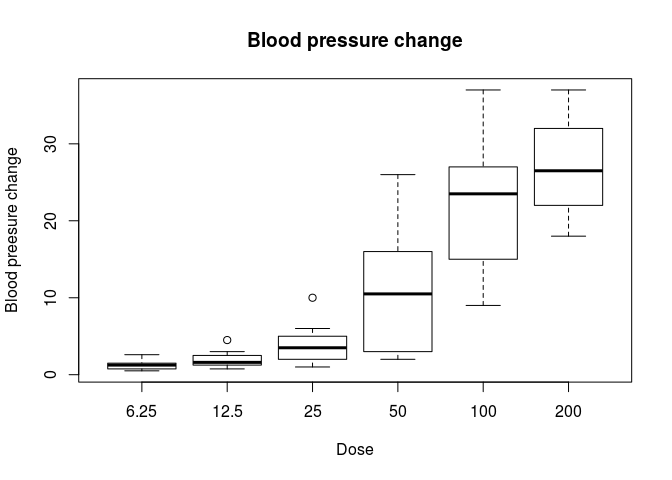
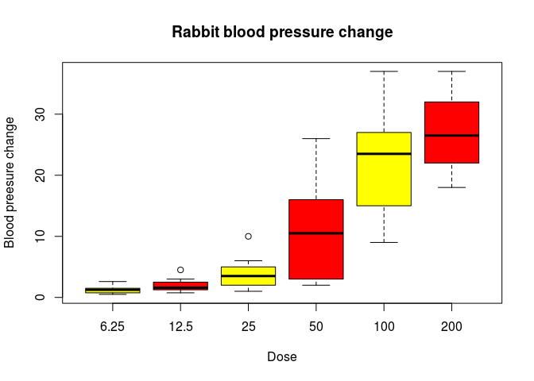
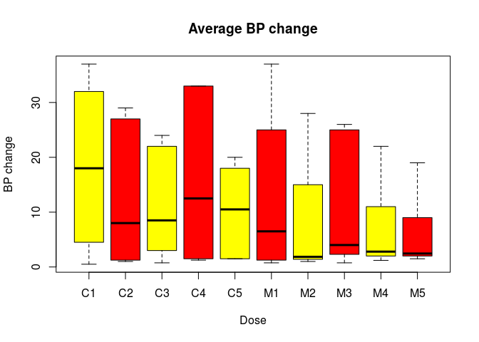
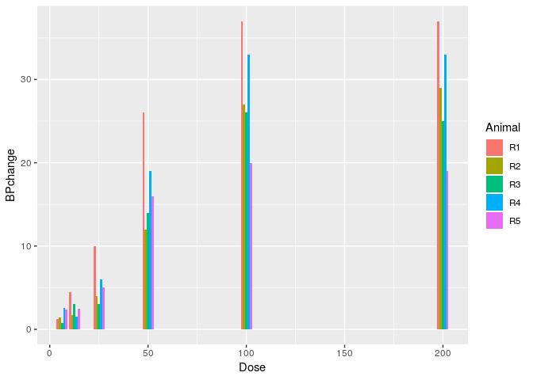
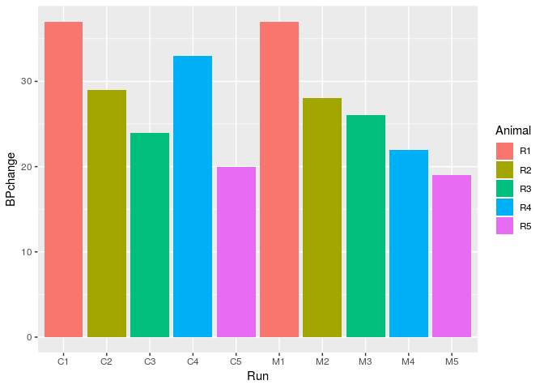

Rabbit blood pressure
================
Sarafa Iyaniwura
September 17, 2018

-   [**Brief description of the data**:](#brief-description-of-the-data)
-   [**Required libraries and loading the data**:](#required-libraries-and-loading-the-data)
    -   [**Calling library**](#calling-library)
    -   [**Brief description of the data**:](#brief-description-of-the-data-1)
-   [**Exploring the data**](#exploring-the-data)
    -   [**Structure of the data**](#structure-of-the-data)
    -   [**Class of the data**](#class-of-the-data)
    -   [**Viewing part of the data**](#viewing-part-of-the-data)
-   [**Plotting some graphs**](#plotting-some-graphs)
    -   [**Boxplot**](#boxplot)
    -   [**ggplot: bar chart**](#ggplot-bar-chart)
-   [**Extracting some fields of the data**](#extracting-some-fields-of-the-data)

**Brief description of the data**:
==================================

In this exercise, a data set containing the blood pressure of five rabbits that were studied after treatment with salime (control) and after treatment with *5-HT\_3 antagonist MDL 72222* is explored. Here is a brief description of the fields in the dataset:

1.  **BP change** : Blood pressure change as a result of specific dose of the medication or control
2.  **Dose**: The dose of medicine or control administered
3.  **Run**: Identifies the animals in each group
4.  **Treatment**: Shows whether medicine or control was administered
5.  **Animal**: Identity of the animals

**Required libraries and loading the data**:
============================================

**Calling library**
-------------------

``` r
require(plyr)
```

    ## Loading required package: plyr

``` r
library(dplyr)
```

    ## 
    ## Attaching package: 'dplyr'

    ## The following objects are masked from 'package:plyr':
    ## 
    ##     arrange, count, desc, failwith, id, mutate, rename, summarise,
    ##     summarize

    ## The following objects are masked from 'package:stats':
    ## 
    ##     filter, lag

    ## The following objects are masked from 'package:base':
    ## 
    ##     intersect, setdiff, setequal, union

``` r
library(ggplot2) # loads ggplot library
```

**Brief description of the data**:
----------------------------------

We begin by loading the library for the data.

``` r
library(MASS)
```

    ## 
    ## Attaching package: 'MASS'

    ## The following object is masked from 'package:dplyr':
    ## 
    ##     select

**Exploring the data**
======================

**Structure of the data**
-------------------------

Let us first look at the stucture of our data.

``` r
str(Rabbit)
```

    ## 'data.frame':    60 obs. of  5 variables:
    ##  $ BPchange : num  0.5 4.5 10 26 37 32 1 1.25 4 12 ...
    ##  $ Dose     : num  6.25 12.5 25 50 100 200 6.25 12.5 25 50 ...
    ##  $ Run      : Factor w/ 10 levels "C1","C2","C3",..: 1 1 1 1 1 1 2 2 2 2 ...
    ##  $ Treatment: Factor w/ 2 levels "Control","MDL": 1 1 1 1 1 1 1 1 1 1 ...
    ##  $ Animal   : Factor w/ 5 levels "R1","R2","R3",..: 1 1 1 1 1 1 2 2 2 2 ...

Hmmm, that was **messy**!!! How about the class the data set?

**Class of the data**
---------------------

``` r
class(Rabbit)
```

    ## [1] "data.frame"

This means we have a data frame.

**Viewing part of the data**
----------------------------

Now let us take a look at the first few rows of the data using the **head()** command.

``` r
head(Rabbit)
```

    ##   BPchange   Dose Run Treatment Animal
    ## 1      0.5   6.25  C1   Control     R1
    ## 2      4.5  12.50  C1   Control     R1
    ## 3     10.0  25.00  C1   Control     R1
    ## 4     26.0  50.00  C1   Control     R1
    ## 5     37.0 100.00  C1   Control     R1
    ## 6     32.0 200.00  C1   Control     R1

By default the head command prints the first six columns of the data. One can also specify the number of rows they will like to display/view. Let us display the first ten rows of our data.

``` r
head(Rabbit,10)
```

    ##    BPchange   Dose Run Treatment Animal
    ## 1      0.50   6.25  C1   Control     R1
    ## 2      4.50  12.50  C1   Control     R1
    ## 3     10.00  25.00  C1   Control     R1
    ## 4     26.00  50.00  C1   Control     R1
    ## 5     37.00 100.00  C1   Control     R1
    ## 6     32.00 200.00  C1   Control     R1
    ## 7      1.00   6.25  C2   Control     R2
    ## 8      1.25  12.50  C2   Control     R2
    ## 9      4.00  25.00  C2   Control     R2
    ## 10    12.00  50.00  C2   Control     R2

Next, we want to display only the **fields/variables** of our data.

``` r
names(Rabbit)
```

    ## [1] "BPchange"  "Dose"      "Run"       "Treatment" "Animal"

We can also count the number of rows and columns in our data as follows:

``` r
NR <- nrow(Rabbit)
NC <- ncol(Rabbit)
```

``` r
cat("Number of rows = ",NR)
```

    ## Number of rows =  60

``` r
cat("number of columns =",NC)
```

    ## number of columns = 5

We can also check the dimension of our data using the **dim()** command.

``` r
dim(Rabbit)
```

    ## [1] 60  5

This means that our data contains 60 rows and 5 columns. In order words, this means that we have 60 observations or experiments and 5 variables.

Let us diaplay the last few lines of the data.

``` r
tail(Rabbit)
```

    ##    BPchange   Dose Run Treatment Animal
    ## 55      2.4   6.25  M5       MDL     R5
    ## 56      2.5  12.50  M5       MDL     R5
    ## 57      1.5  25.00  M5       MDL     R5
    ## 58      2.0  50.00  M5       MDL     R5
    ## 59      9.0 100.00  M5       MDL     R5
    ## 60     19.0 200.00  M5       MDL     R5

By default, the tail command also dispalys the last six line of the data, but one can specify the number of rows they want to display. Let us display the last ten rows.

``` r
tail(Rabbit,10)
```

    ##    BPchange   Dose Run Treatment Animal
    ## 51      2.0  25.00  M4       MDL     R4
    ## 52      3.0  50.00  M4       MDL     R4
    ## 53     11.0 100.00  M4       MDL     R4
    ## 54     22.0 200.00  M4       MDL     R4
    ## 55      2.4   6.25  M5       MDL     R5
    ## 56      2.5  12.50  M5       MDL     R5
    ## 57      1.5  25.00  M5       MDL     R5
    ## 58      2.0  50.00  M5       MDL     R5
    ## 59      9.0 100.00  M5       MDL     R5
    ## 60     19.0 200.00  M5       MDL     R5

The summary of our data can be displayed using the **summary()** command.

``` r
summary(Rabbit)
```

    ##     BPchange          Dose             Run       Treatment  Animal 
    ##  Min.   : 0.50   Min.   :  6.25   C1     : 6   Control:30   R1:12  
    ##  1st Qu.: 1.65   1st Qu.: 12.50   C2     : 6   MDL    :30   R2:12  
    ##  Median : 4.75   Median : 37.50   C3     : 6                R3:12  
    ##  Mean   :11.22   Mean   : 65.62   C4     : 6                R4:12  
    ##  3rd Qu.:20.50   3rd Qu.:100.00   C5     : 6                R5:12  
    ##  Max.   :37.00   Max.   :200.00   M1     : 6                       
    ##                                   (Other):24

This command summarizes our data column by column.

**Plotting some graphs**
========================

Maybe we can try plot some graphs!

**Boxplot**
-----------

Let us start with a **boxplot()** of the change in blood pressure cause by each dose given.

``` r
boxplot(BPchange~Dose,Rabbit, main="Blood pressure change",ylab="Blood preesure change", xlab="Dose")
```



This plot shows the median, upper quartile, lower quartile, maximum, and minimum change in blood pressure with respect to the administered Dose. It also show the Dose that result in the largest change in the blood pressure of the rabbits is 200.

We can plot a more fancy boxplot.

``` r
boxplot(BPchange~Dose, data=Rabbit, col=(c("yellow","red")),main="Rabbit blood pressure change",ylab="Blood preesure change", xlab="Dose")
```



We can also use boxplot to show the median, upper quartile, lower quartile, maximum, and minimum of the BP change for each run of the treatments administered.

``` r
boxplot(BPchange~Run, data=Rabbit, col=(c("yellow","red")),main="Average BP change",ylab="BP change", xlab="Dose")
```



**ggplot: bar chart**
---------------------

Now, let us illustrate how to use **ggplot** for creating bar charts

``` r
ggplot(Rabbit, aes(fill=Animal, y=BPchange, x=Dose)) + 
    geom_bar(position="dodge", stat="identity")
```



This chart shows the distribution of change in blood pressure for each does of medication and each Rabbit.

Another way of using the bar chart is shown below. Here, the charts shows the BP change for each animal (the colors) based on the treatment administered.

``` r
ggplot(Rabbit, aes(fill=Animal, y=BPchange, x=Run)) + 
    geom_bar(position="dodge", stat="identity")
```



**Extracting some fields of the data**
======================================

One can also extract the data for each field into a vector.

Creating the vectors, we use the **$** sign as illustrated below.

1.  **Blood pressure change**

``` r
BP <- Rabbit$BPchange  # create a vector for BP change
BP # displays the vectors
```

    ##  [1]  0.50  4.50 10.00 26.00 37.00 32.00  1.00  1.25  4.00 12.00 27.00
    ## [12] 29.00  0.75  3.00  3.00 14.00 22.00 24.00  1.25  1.50  6.00 19.00
    ## [23] 33.00 33.00  1.50  1.50  5.00 16.00 20.00 18.00  1.25  0.75  4.00
    ## [34]  9.00 25.00 37.00  1.40  1.70  1.00  2.00 15.00 28.00  0.75  2.30
    ## [45]  3.00  5.00 26.00 25.00  2.60  1.20  2.00  3.00 11.00 22.00  2.40
    ## [56]  2.50  1.50  2.00  9.00 19.00

1.  **Dose**

``` r
DD <- Rabbit$Dose # Dose administered
DD # displays the vector
```

    ##  [1]   6.25  12.50  25.00  50.00 100.00 200.00   6.25  12.50  25.00  50.00
    ## [11] 100.00 200.00   6.25  12.50  25.00  50.00 100.00 200.00   6.25  12.50
    ## [21]  25.00  50.00 100.00 200.00   6.25  12.50  25.00  50.00 100.00 200.00
    ## [31]   6.25  12.50  25.00  50.00 100.00 200.00   6.25  12.50  25.00  50.00
    ## [41] 100.00 200.00   6.25  12.50  25.00  50.00 100.00 200.00   6.25  12.50
    ## [51]  25.00  50.00 100.00 200.00   6.25  12.50  25.00  50.00 100.00 200.00

``` r
unique(DD) # removes repetition
```

    ## [1]   6.25  12.50  25.00  50.00 100.00 200.00

1.  **Animal**

``` r
RAB <- Rabbit$Animal # The animal
RAB # display the vector
```

    ##  [1] R1 R1 R1 R1 R1 R1 R2 R2 R2 R2 R2 R2 R3 R3 R3 R3 R3 R3 R4 R4 R4 R4 R4
    ## [24] R4 R5 R5 R5 R5 R5 R5 R1 R1 R1 R1 R1 R1 R2 R2 R2 R2 R2 R2 R3 R3 R3 R3
    ## [47] R3 R3 R4 R4 R4 R4 R4 R4 R5 R5 R5 R5 R5 R5
    ## Levels: R1 R2 R3 R4 R5

``` r
unique(RAB) # removes repetition
```

    ## [1] R1 R2 R3 R4 R5
    ## Levels: R1 R2 R3 R4 R5
